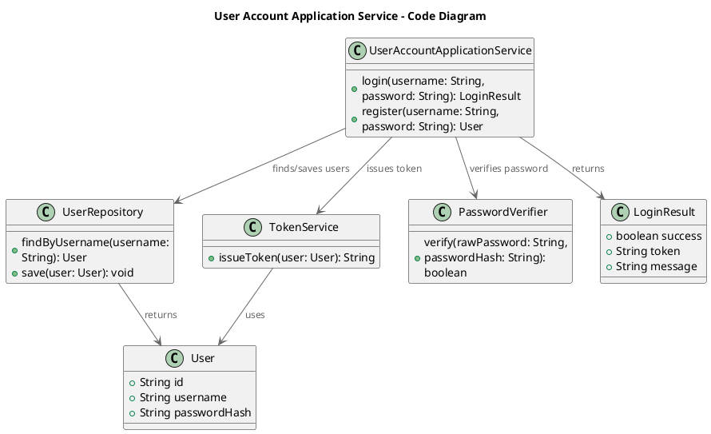

# C4 Code Diagram

Диаграмма кода компонента User Account Application Service

```plantuml
@startuml
!include <C4/C4_Component>


title User Account Application Service - Code Diagram

class UserAccountApplicationService {
  +login(username: String, password: String): LoginResult
  +register(username: String, password: String): User
}

class UserRepository {
  +findByUsername(username: String): User
  +save(user: User): void
}

class TokenService {
  +issueToken(user: User): String
}

class PasswordVerifier {
  +verify(rawPassword: String, passwordHash: String): boolean
}

class User {
  +String id
  +String username
  +String passwordHash
}

class LoginResult {
  +boolean success
  +String token
  +String message
}

UserAccountApplicationService --> UserRepository : finds/saves users
UserAccountApplicationService --> PasswordVerifier : verifies password
UserAccountApplicationService --> TokenService : issues token
UserRepository --> User : returns
TokenService --> User : uses
UserAccountApplicationService --> LoginResult : returns

@enduml
```