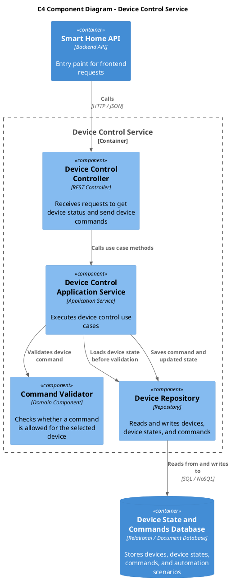

# C4 Component Diagram - Device Control Service

Какие компоненты составляют контейнер `Device Control Service`.

```plantuml
@startuml
!include <C4/C4_Component>

title C4 Component Diagram - Device Control Service

Container(api, "Smart Home API", "Backend API", "Entry point for frontend requests")
ContainerDb(deviceDb, "Device State and Commands Database", "Relational / Document Database", "Stores devices, device states, commands, and automation scenarios")

Container_Boundary(controlService, "Device Control Service") {

    Component(controlController, "Device Control Controller", "REST Controller", "Receives requests to get device status and send device commands")

    Component(controlAppService, "Device Control Application Service", "Application Service", "Executes device control use cases")

    Component(commandValidator, "Command Validator", "Domain Component", "Checks whether a command is allowed for the selected device")

    Component(deviceRepository, "Device Repository", "Repository", "Reads and writes devices, device states, and commands")
}

Rel(api, controlController, "Calls", "HTTP / JSON")
Rel(controlController, controlAppService, "Calls use case methods")
Rel(controlAppService, deviceRepository, "Loads device state before validation")
Rel(controlAppService, commandValidator, "Validates device command")
Rel(controlAppService, deviceRepository, "Saves command and updated state")
Rel(deviceRepository, deviceDb, "Reads from and writes to", "SQL / NoSQL")

@enduml
```
