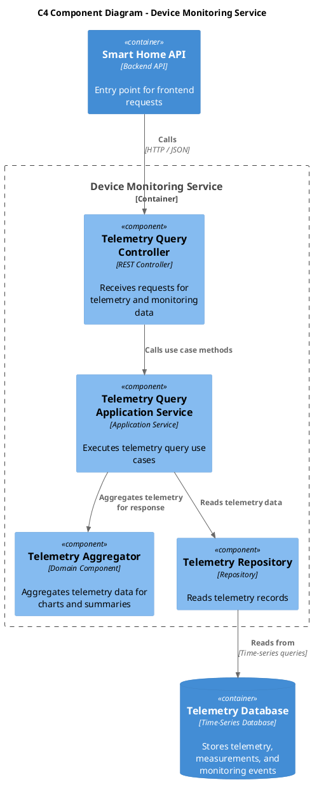

# C4 Component Diagram - Device Monitoring Service

Какие компоненты составляют контейнер `Device Monitoring Service`.

```plantuml
@startuml
!include <C4/C4_Component>

title C4 Component Diagram - Device Monitoring Service

Container(api, "Smart Home API", "Backend API", "Entry point for frontend requests")
ContainerDb(telemetryDb, "Telemetry Database", "Time-Series Database", "Stores telemetry, measurements, and monitoring events")

Container_Boundary(monitoringService, "Device Monitoring Service") {

    Component(telemetryController, "Telemetry Query Controller", "REST Controller", "Receives requests for telemetry and monitoring data")

    Component(telemetryAppService, "Telemetry Query Application Service", "Application Service", "Executes telemetry query use cases")

    Component(telemetryAggregator, "Telemetry Aggregator", "Domain Component", "Aggregates telemetry data for charts and summaries")

    Component(telemetryRepository, "Telemetry Repository", "Repository", "Reads telemetry records")
}

Rel(api, telemetryController, "Calls", "HTTP / JSON")
Rel(telemetryController, telemetryAppService, "Calls use case methods")
Rel(telemetryAppService, telemetryRepository, "Reads telemetry data")
Rel(telemetryAppService, telemetryAggregator, "Aggregates telemetry for response")
Rel(telemetryRepository, telemetryDb, "Reads from", "Time-series queries")

@enduml
```
