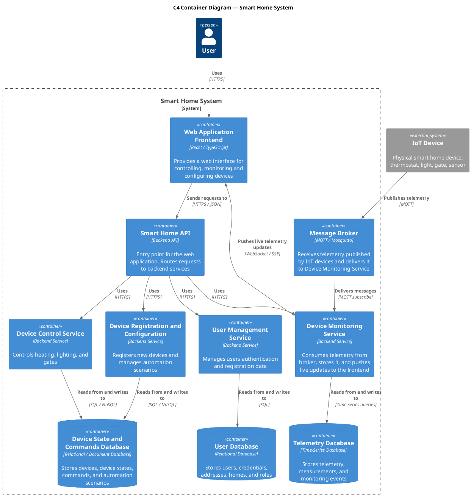

```plantuml
@startuml

!include <C4/C4_Component>
title C4 Container Diagram — Smart Home System

Person(user, "User")
System_Ext(iotDevice, "IoT Device", "Physical smart home device: thermostat, light, gate, sensor")

System_Boundary(smarthome, "Smart Home System") {

    Container(webApp, "Web Application Frontend", "React / TypeScript", "Provides a web interface for controlling, monitoring and configuring devices")

    Container(api, "Smart Home API", "Backend API", "Entry point for the web application. Routes requests to backend services")

    Container(authService, "User Management Service", "Backend Service", "Manages users authentication and registration data")

    Container(controlService, "Device Control Service", "Backend Service", "Controls heating, lighting, and gates")

    Container(deviceService, "Device Registration and Configuration", "Backend Service", "Registers new devices and manages automation scenarios")

    Container(messageBroker, "Message Broker", "MQTT / Mosquitto", "Receives telemetry published by IoT devices and delivers it to Device Monitoring Service")

    Container(monitoringService, "Device Monitoring Service", "Backend Service", "Consumes telemetry from broker, stores it, and pushes live updates to the frontend")

    ContainerDb(userDb, "User Database", "Relational Database", "Stores users, credentials, addresses, homes, and roles")

    ContainerDb(deviceDb, "Device State and Commands Database", "Relational / Document Database", "Stores devices, device states, commands, and automation scenarios")

    ContainerDb(telemetryDb, "Telemetry Database", "Time-Series Database", "Stores telemetry, measurements, and monitoring events")
}

' Пользователь → фронтенд
Rel(user, webApp, "Uses", "HTTPS")

' Фронтенд → API (синхронные запросы)
Rel(webApp, api, "Sends requests to", "HTTPS / JSON")

' Фронтенд ← Monitoring Service (асинхронный push на дашборд)
Rel(monitoringService, webApp, "Pushes live telemetry updates", "WebSocket / SSE")

' API → сервисы
Rel(api, authService, "Uses", "HTTPS")
Rel(api, controlService, "Uses", "HTTPS")
Rel(api, deviceService, "Uses", "HTTPS")
Rel(api, monitoringService, "Uses", "HTTPS")

' Сервисы → базы данных
Rel(authService, userDb, "Reads from and writes to", "SQL")
Rel(controlService, deviceDb, "Reads from and writes to", "SQL / NoSQL")
Rel(deviceService, deviceDb, "Reads from and writes to", "SQL / NoSQL")
Rel(monitoringService, telemetryDb, "Reads from and writes to", "Time-series queries")

' Асинхронный поток телеметрии
Rel(iotDevice, messageBroker, "Publishes telemetry", "MQTT")
Rel(messageBroker, monitoringService, "Delivers messages", "MQTT subscribe")

@enduml
```