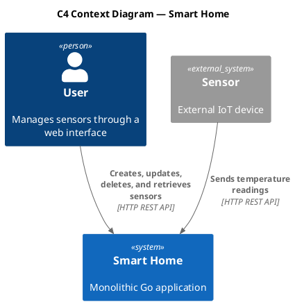

# C4 Context Diagram

Как монолитное приложение взаимодействует с внешним миром (пользователи, датчики).

```plantuml
@startuml
!include <C4/C4_Component>

title C4 Context Diagram — Smart Home

Person(user, "User", "Manages sensors through a web interface")

System(smartHome, "Smart Home", "Monolithic Go application")

System_Ext(sensor, "Sensor", "External IoT device")

Rel(user, smartHome, "Creates, updates, deletes, and retrieves sensors", "HTTP REST API")
Rel(sensor, smartHome, "Sends temperature readings", "HTTP REST API")

@enduml
```
