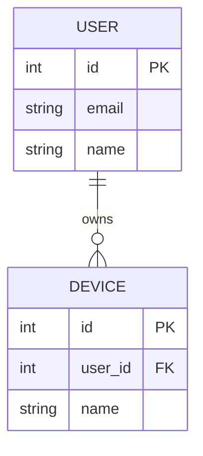

```mermaid
erDiagram
    USER {
        int id PK
        string email
        string name
    }
    DEVICE {
        int id PK
        int user_id FK
        string name
    }
    USER ||--o{ DEVICE : owns
```